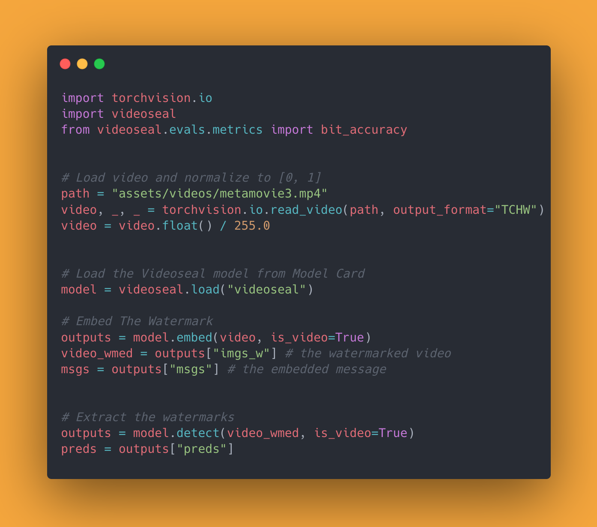

# :movie_camera: :seal: VideoSeal: Open and Efficient Video Watermarking


# Abstract

We introduce VideoSeal, a comprehensive framework for neural video watermarking, a flexible training and inference codebase and competitive open-sourced models. Our approach jointly trains an embedder and an extractor, while ensuring the watermark robustness by applying transformations in-between, e.g., video codecs.
VideoSeal achieves higher robustness compared to baselines especially under challenging distortions combining geometric transformations and video compression. Additionally, we provide new insights such as the impact of video compression during training, how to compare methods operating at different payloads.

| Original | Videoseal output | The watermark (nomalized for visibility)|
|---|---|---|
|  |  |  |
|  |  |  |
|  |  |  |
|  |  |  |
|  |  |  |


# Using VideoSeal 



## Setup

### Requirements

Version of Python is 3.10 (pytorch > 2.3, torchvision 0.16.0, torchaudio 2.1.0, cuda 12.1).
Install pytorch:
```
conda install pytorch==2.4.0 torchvision==0.19.0 torchaudio==2.4.0 pytorch-cuda=12.1 -c pytorch -c nvidia

pip install -e . 
```


#### VMAF

For VMAF score, install latest git build from [here](https://johnvansickle.com/ffmpeg/builds), then update the PATH:
```
wget https://johnvansickle.com/ffmpeg/builds/ffmpeg-git-amd64-static.tar.xz
tar -xvf ffmpeg-git-amd64-static.tar.xz 
export PATH=$PATH:/path/to/ffmpeg-git-20220307-amd64-static
```
Test the installation with:
```
which ffmpeg
ffmpeg -version
ffmpeg -filters | grep vmaf
```
It should output the path to the ffmpeg binary, the version of ffmpeg and the vmaf filter.


## Running experiments


### Launch simple experiment on Devfairs

To run on 2 GPUs:

`torchrun --nproc_per_node=2 train.py --local_rank 0`

