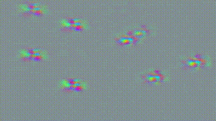

# :movie_camera: :seal: Video Seal: Open and Efficient Video Watermarking


Official implementation of Video Seal: training and inference code for video watermarking, and state-of-the-art open-sourced models.

<!-- Our approach leverages temporal watermark propagation, a novel technique that converts any image watermarking model into an efficient video watermarking model, eliminating the need to watermark every frame in a video. We also propose a multistage training regimen that includes image pre-training, hybrid post-training, and extractor fine-tuning, supplemented with a range of differentiable augmentations. This repository includes pre-trained models, training code, inference code, baselines of state-of-the-art image watermarking models adapted for video watermarking (including MBRS, TrustMark, and WAM), and evaluation tools, all released under the MIT license, allowing for free use, modification, and distribution of the code and models. -->

[[`arXiv`](https://arxiv.org/abs/ARXIV_LINK)]
[[`Colab`](https://colab.research.google.com/github/facebookresearch/videoseal/blob/main/notebooks/colab.ipynb)]
[[`Demo`](https://aidemos.meta.com/videoseal)]

| Original | Video Seal output | The watermark (normalized for visibility)|
|---|---|---|
|  |  |  |
|  |  |  |
|  |  |  |
<!-- |  |  |  | -->
<!-- |  |  |  | -->


## Video watermarking using Video Seal  

```python
import torchvision.io
import videoseal
from videoseal.evals.metrics import bit_accuracy

# Load video and normalize to [0, 1]
video_path = "assets/videos/1.mp4"
video, _ = torchvision.io.read_video(video_path, output_format="TCHW")
video = video.float() / 255.0

# Load the model
model = videoseal.load("videoseal")

# Video Watermarking
outputs = model.embed(video, is_video=True) # this will embed a random msg
video_w = outputs["imgs_w"] # the watermarked video
msgs = outputs["msgs"] # the embedded message

# Extract the watermark message
msg_extracted = model.extract_message(imgs_w, aggregation="avg", is_video=True)

# VideoSeal can do Image Watermarking
img = video[0:1] # 1 x C x H x W
outputs = model.embed(img, is_video=False)
img_w = outputs["imgs_w"] # the watermarked image
msg_extracted = model.extract_message(imgs_w, aggregation="avg", is_video=False)
```


## Installation

### Download the model

### Requirements

Version of Python is 3.10 (pytorch > 2.3, torchvision 0.16.0, torchaudio 2.1.0, cuda 12.1).
Install pytorch:

```
conda install pytorch==2.4.0 torchvision==0.19.0 torchaudio==2.4.0 pytorch-cuda=12.1 -c pytorch -c nvidia

pip install -e . 
```

### VMAF

For VMAF score, install latest git build from [here](https://johnvansickle.com/ffmpeg/builds), then update the PATH:

```
wget https://johnvansickle.com/ffmpeg/builds/ffmpeg-git-amd64-static.tar.xz
tar -xvf ffmpeg-git-amd64-static.tar.xz 
export PATH=$PATH:/path/to/ffmpeg-git-20220307-amd64-static
```

Test the installation with:
```
which ffmpeg
ffmpeg -version
ffmpeg -filters | grep vmaf
```
It should output the path to the ffmpeg binary, the version of ffmpeg and the vmaf filter.


## Training


### Launch simple experiment a single machine with 2 GPUs 

```
torchrun --nproc_per_node=2 train.py --local_rank 0  
```


## License

The model is licensed under an [MIT license](LICENSE).

## Contributing

See [contributing](.github/CONTRIBUTING.md) and the [code of conduct](.github/CODE_OF_CONDUCT.md).

## See Also

- [**AudioSeal**](https://github.com/facebookresearch/audioseal)
- [**Watermark-Anything**](https://github.com/facebookresearch/watermark-anything/)

## Citation

If you find this repository useful, please consider giving a star :star: and please cite as:

```bibtex
@article{fernandez2024video,
  title={Video Seal: Open and Efficient Video Watermarking},
  author={Fernandez, Pierre and Elsahar, Hady and Yalniz, I. Zeki and Mourachko, Alexandre},
  journal={arXiv preprint arXiv:ARXIV_LINK},
  year={2024}
}